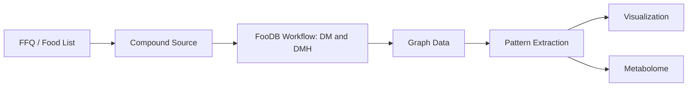
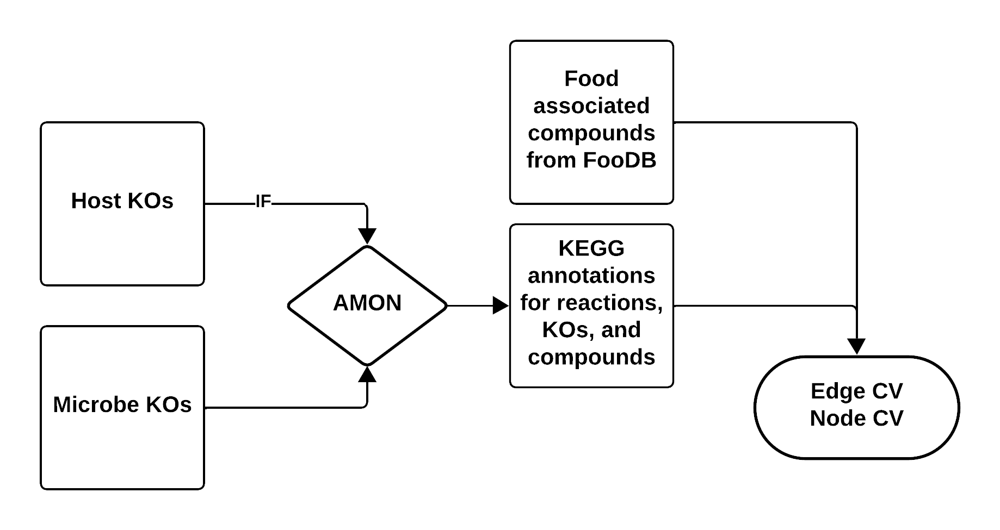

# Running the Pipeline

This pipeline converts dietary data (e.g., FFQs) and microbial gene information into a
graph structure for analyzing metabolic interactions between food and gut microbes.

---

## Overview



| Step | Description | Required |
|------|-------------|----------|
| 1 | Launch Streamlit app to create machine-readable FFQ | Optional |
| 2 | Choose compound source (FooDB or KEGG) | ✅ |
| 2A | If FooDB, determine if host is included | Optional |
| 3A/3B | Generate nodes and edges | ✅ |
| 4 | Microbial compound report | Optional |
| 5 | Build graph and extract patterns | ✅ |
| 6 | Visualize results | Optional |
| 7 | Metabolome comparison | Optional |

---

## Step 1 — Create a Machine-Readable FFQ

Food Frequency Questionnaires (FFQs) capture how often participants consume specific foods,
but they aren't directly usable in computational workflows due to format heterogeneity,
lack of molecular resolution, and inconsistent structure.

A Streamlit app is provided to generate standardized, machine-readable FFQ datasets that
map food items to compounds via **FooDB**.

```bash
streamlit run src/get_foods.py
```

In the app:
1. Search for and select foods
2. Assign a consumption frequency (1–100%)
3. Download the generated dataset
4. Shut down the application

!!! tip "No FFQ? No problem."
    You can run the pipeline using all foods available in FooDB. Skip food metadata
    creation in Step 3A, or pass the `foodb` and `all-foods` flags in the workflow runner.
    Food compound reports are skipped due to dataset size.

---

## Step 2 — Choose a Compound Source

### Option A: FooDB (Experimental)

FooDB contains compounds identified in foods via LC-MS experiments, many of which link
to KEGG. Core metabolic compounds (amino acids, sugars, fatty acids, nucleotides) are
well-represented, but specialized plant compounds (flavonoids, alkaloids, terpenes) may
be missing.

**Limitations:** Incomplete compound coverage · Limited food representation · U.S.-centric food data

### Option B: KEGG Whole Genomes (Genome-Based Prediction)

Compounds are inferred from an organism's genome based on its metabolic capabilities
using KEGG organism data.

**Limitations:** Requires decomposing complex foods into components · Doesn't account for
ripeness or cooking · Predictions may not reflect actual composition



!!! note
    [AMON](https://github.com/lozuponelab/AMON) takes a list of KOs and finds producible
    compounds via KEGG reactions, assigning their origin (dietary vs. microbial).

---

## Step 3 — FooDB Workflow

### 1. Generate Food–Compound Metadata

> Skip this step if using all FooDB foods — `Data/AllFood/food_meta.csv` is pre-built.

```bash
Rscript src/dietmicrobe/comp_FoodDB.R \
  --diet_file  "Data/test_sample/foodb_foods_dataframe.csv" \
  --content_file "Data/Content.csv" \
  --ExDes_file "Data/CompoundExternalDescriptor.csv" \
  --meta_o_file "food_meta.csv"
```

**Output:** Food items mapped to KEGG compound IDs with aggregated consumption frequencies.

### 2. Generate Food Compound Report *(optional)*

> Skip if using all foods — the dataset is too large.

```bash
python src/dietmicrobe/RenderCompoundAnalysis.py \
  --food_file "food_meta.csv" \
  --output "food_compound_report.html"
```

### 3. Run AMON

```bash
amon.py \
  -i "Data/test_sample/noquote_ko.txt" \
  -o "AMON_output/" \
  --save_entries
```

### 4. Create Graph Data

```bash
python src/dietmicrobe/main_metab.py \
  --f "food_meta.csv" \
  --r "AMON_output/rn_dict.json" \
  --m_meta "Data/test_sample/ko_taxonomy_abundance.csv" \
  --e-weights \
  --n-weights \
  --org \
  --a "Abundance_RPKs" \
  --o "graph/"
```

---

## Step 4 — Microbial Compound Report *(optional)*

Requires microbial taxonomy and abundance data.

```bash
python src/RenderCompoundAnalysis_Microbe.py \
  --node_file "graph/nodes.csv" \
  --edge_file "graph/edges.csv" \
  --output "microbe_compound_report.html"
```

---

## Step 5 — Build Graph and Extract Patterns

For **Diet -> Microbe** patterns run: 

```bash
python src/dietmicrobe/run_graph.py \
  --n "graph/nodes.csv" \
  --e "graph/edges.csv" \
  --o "graph_results.csv"
```

**Patterns identified:**

| Pattern | Description |
|---------|-------------|
| Food → Microbe | Compound produced by diet, consumed by microbe |
| Food → Both | Compound shared between diet and microbial production |
| Both → Both | Compound produced and consumed across both sources |

For **Diet -> Microbe -> Host** patterns run: 

```bash
python src/dietmicrobehost/host_run_graph.py \
  --n "graph/nodes.csv" \
  --e "graph/edges.csv" \
  --o "graph_results.csv"
```

**Patterns identified**

| # | Pattern | Description |
|---|---------|-------------|
| 1 | diet → microbe → host | Diet-only → microbial-only → host-only transformation |
| 2 | diet → microbe → hostdiet | Diet-only → microbial-only → host or diet origin |
| 3 | diet → microbe → hostmicrobe | Diet-only → microbial-only → host or microbial origin |
| 4 | diet → microbe → all | Diet-only → microbial-only → any source |
| 5 | diet → microbediet → host | Diet-only → diet or microbial → host-only |
| 6 | diet → microbediet → hostdiet | Diet-only → diet or microbial → host or diet origin |
| 7 | diet → microbediet → hostmicrobe | Diet-only → diet or microbial → host or microbial origin |
| 8 | diet → microbediet → all | Diet-only → diet or microbial → any source |
| 9 | diet → all → host | Diet-only → any source → host-only |
| 10 | diet → all → hostdiet | Diet-only → any source → host or diet origin |
| 11 | diet → all → hostmicrobe | Diet-only → any source → host or microbial origin |
| 12 | diet → all → all | Diet-only → any source → any source |
| 13 | microbediet → microbe → host | Diet or microbial → microbial-only → host-only |
| 14 | microbediet → microbe → hostdiet | Diet or microbial → microbial-only → host or diet origin |
| 15 | microbediet → microbe → hostmicrobe | Diet or microbial → microbial-only → host or microbial origin |
| 16 | microbediet → microbe → all | Diet or microbial → microbial-only → any source |
| 17 | microbediet → microbediet → host | Diet or microbial → diet or microbial → host-only |
| 18 | microbediet → microbediet → hostdiet | Diet or microbial → diet or microbial → host or diet origin |
| 19 | microbediet → microbediet → hostmicrobe | Diet or microbial → diet or microbial → host or microbial origin |
| 20 | microbediet → microbediet → all | Diet or microbial → diet or microbial → any source |
| 21 | microbediet → all → host | Diet or microbial → any source → host-only |
| 22 | microbediet → all → hostdiet | Diet or microbial → any source → host or diet origin |
| 23 | microbediet → all → hostmicrobe | Diet or microbial → any source → host or microbial origin |
| 24 | microbediet → all → all | Diet or microbial → any source → any source |
| 25 | all → microbe → host | Any source → microbial-only → host-only |
| 26 | all → microbe → hostdiet | Any source → microbial-only → host or diet origin |
| 27 | all → microbe → hostmicrobe | Any source → microbial-only → host or microbial origin |
| 28 | all → microbe → all | Any source → microbial-only → any source |
| 29 | all → microbediet → host | Any source → diet or microbial → host-only |
| 30 | all → microbediet → hostdiet | Any source → diet or microbial → host or diet origin |
| 31 | all → microbediet → hostmicrobe | Any source → diet or microbial → host or microbial origin |
| 32 | all → microbediet → all | Any source → diet or microbial → any source |
| 33 | all → all → host | Any source → any source → host-only |
| 34 | all → all → hostdiet | Any source → any source → host or diet origin |
| 35 | all → all → hostmicrobe | Any source → any source → host or microbial origin |
| 36 | all → all → all | Any source → any source → any source |

---

## Step 6 — Visualize Graph Results

```bash
python src/dietmicrobe/RenderGraphResults_Report.py \
  --patterns "graph_results.csv" \
  --rxn_json "AMON_output/rn_dict.json" \
  --output "graph_results_report.html"
```
or 

```bash
python src/dietmicrobehost/RenderGraphResults_Report.py \
  --patterns "graph_results.csv" \
  --rxn_json "AMON_output/rn_dict.json" \
  --output "graph_results_report.html"
```

## Step 7 — Metabolome Comparison 

To view which compounds identified in the patterns were also found in a metabolomics experiment you performed, two inputs are needed: 

### Inputs 

1. A `graph_results.csv` or the output of Step 4. 

2. CSV containing a list of KEGG compounds that were identified in the metabolome. An example of this file can be found in `Data/test_sample/metabolome.csv`.

### Running the script 

To get a list of optional and required arguments run `python src/RenderMetabolomeComparison.py -h`:

```
options:
  -h, --help            show this help message and exit
  --patterns PATTERNS   Path to the graph_results.csv
  --metabolome METABOLOME
                        Path to CSV file containing one column of KEGG compounds.
  --output OUTPUT       Path to HTML report file
```

!!! tip
    Use `run_workflow.py` to run steps 2-7 with Snakemake workflow described on the [home page](index.md) automatically. See the [Quick Start guide](quickstart.md) for a complete example.